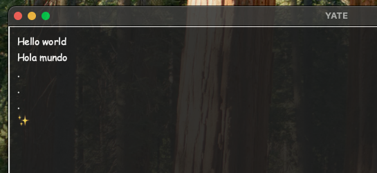

## Yet Another Text Editor (YATE)

### YATE Python

A lightweight text editor built with **Python** and **Tkinter**, designed for simplicity and basic productivity.

#### Core Features

- Text Editing
    - Multi-line text editing.
    - Word wrapping.

- File Operations
    - New File, create a new fresh file.
    - Open File: Opens text files from a user-selected location.
    - Save File: Saves content to the current file or prompts for location if new.
    - Save As: Allows saving with a custom filename and location.

- Emoji Insertion
    - Loads emojis from assets/emojis.txt.
    - Insert Emoji menu for quick emoji input.

- Menus & Shortcuts
    - File Menu with options: New, Open, Save, Save As, Quit.
    - Keyboard Shortcuts:
        - Ctrl+N → New
        - Ctrl+O → Open
        - Ctrl+S → Save
        - Ctrl+W → Save As
        - Ctrl+Q → Quit

- Unsaved Changes Detection
    - Warns user before closing or opening a new file if unsaved changes exist.

- Persistent Metadata
    - Stores last used directory in assets/metadata.json

#### Setup
Recommended python version: 3.10

#### Run

```bash
cd yate-python
python3 main.py
```




-------