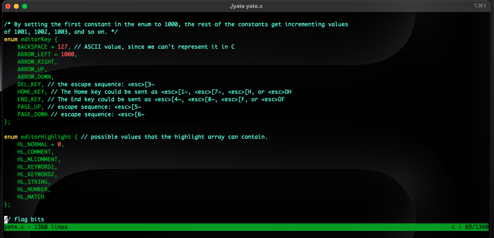

## Yet Another Text Editor (YATE)

### YATE Python

A lightweight text editor built with **Python** and **Tkinter**, designed for simplicity and basic productivity.

#### Core Features

- Text Editing
    - Multi-line text editing.
    - Word wrapping.

- File Operations
    - New File, create a new fresh file.
    - Open File: Opens text files from a user-selected location.
    - Save File: Saves content to the current file or prompts for location if new.
    - Save As: Allows saving with a custom filename and location.

- Emoji Insertion
    - Loads emojis from assets/emojis.txt.
    - Insert Emoji menu for quick emoji input.

- Menus & Shortcuts
    - File Menu with options: New, Open, Save, Save As, Quit.
    - Keyboard Shortcuts:
        - Ctrl+N → New
        - Ctrl+O → Open
        - Ctrl+S → Save
        - Ctrl+W → Save As
        - Ctrl+Q → Quit

- Unsaved Changes Detection
    - Warns user before closing or opening a new file if unsaved changes exist.

- Persistent Metadata
    - Stores last used directory in assets/metadata.json

#### Setup
Recommended python version: 3.10

#### Run

```bash
cd yate-python
python3 main.py
```


-------


### YATE C

Minimal text editor based in Kilo editor, tutorial from [here](https://viewsourcecode.org/snaptoken/kilo/index.html).


#### Main features

- Terminal based text editor.
- Render tabs.
- Bar status with filename, number of lines and filetype.
- Quit confirmation.
- Basic and incremental search with position relocation for matches.
- Highlight matches when searching.
- Highlight digits, strings and comments for C files.


#### Main shortcuts
- Ctrl+s to save into disk.
- Ctrl+q to quit (press 3 times to confirm when there are modifications).
- Ctrl+f to search.

#### Run

```bash
cd yate-c
make
./yate yate.c
```

Note: this opens the code of the text editor in the same code editor, you can initate a new file only executing `./yate`.


